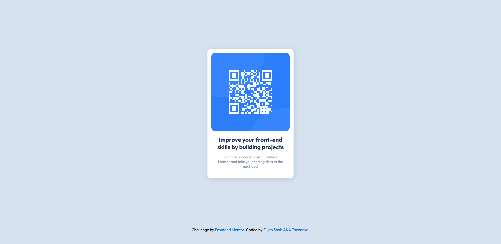

# Frontend Mentor - QR code component solution

This is a solution to the [QR code component challenge on Frontend Mentor](https://www.frontendmentor.io/challenges/qr-code-component-iux_sIO_H). Frontend Mentor challenges help you improve your coding skills by building realistic projects. 

## Table of contents

- [Overview](#overview)
  - [Screenshot](#screenshot)
  - [Links](#links)
- [My process](#my-process)
  - [Built with](#built-with)
  - [What I learned](#what-i-learned)
  - [Continued development](#continued-development)
  - [Useful resources](#useful-resources)
- [Author](#author)
- [Acknowledgments](#acknowledgments)

## Overview

This is my very first hand-coded project. I've only worked with drag-and-drop interfaces for building sites before, so this is exciting!

### Screenshot



### Links

- Solution URL: [Frontend Mentor Solution](https://www.frontendmentor.io/solutions/qr-code-component-using-html-and-css-C6iYF78-ML)
- Live Site URL: [Github Pages](https://taco-neko.github.io/frontend-mentor-qr-code-challenge/)

## My process

### Built with

- Semantic HTML5 markup
- CSS custom properties

### What I learned

I learnt a lot about how to use custom properties correctly, via making a silly mistake (of course).

I'd initially set up the variables for my colours like this:

```css
:root {
  --white: hsl(0, 0%, 100%);
}
```

This worked fine for most things like text colours but I ran into issues when adding the box shadow. I needed a lower opacity on it, and the variable wasn't working right. I tried about 3 different methods and got frustrated. It sounds silly, because you can probably already tell what mistake I made, but all I had to do was change it to

```css
:root {
  --white: 0, 0%, 100%;
}
```

and I could edit the opacity with no problem. Making silly mistakes like this is how you learn though, so that's fine, lol.

### Continued development

One thing I'm still a bit confused about is what units to use, and when. I used rems to size a lot of the stuff, which I think is fine. Still a bit confused though and would love some advice on it.

I'm also especially interested in accessibility, so I added alt text to the QR code image- but there's got to be more to it than that, right? One resource I saw online said that I should just hyperlink the image, and I'm not a big fan of that idea. My idea was to try and put some screen-reader-only text that's linked... but then I realised that didn't make sense, because how is anyone going to click on it? Anyway, I'd really like to learn more about this stuff.

### Useful resources

- [PX to REM Converter](https://pixelsconverter.com/px-to-rem) - The style guide provided the font size in pixels, so I used this to convert it.

## Author

- Frontend Mentor - [@taco-neko](https://www.frontendmentor.io/profile/taco-neko)

## Acknowledgments

Special thanks to:
- The delivery guy who delivered the ice cream I ate while working on this
- Hatsune Miku
